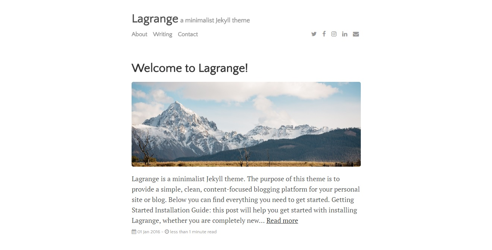

# TheSoulbiz

TheSoulbiz is a simple blog to share and explore some new & old technologies and (hopefully) some helpful tricks!
It is based on the [Lagrange](https://lenpaul.github.io/Lagrange/) layout.

### Added

* A tag system to sort the posts by keywords.
You can navigate a normal tag list or tag cloud for that purpose.
You can also check a post's tags at the end of it!
That way you can directly access the index listing the other posts that share the same tag.

* Stylish card-like entries in the "About" section (taken from _includes html).

* "Friends" menu tab with other people's sites. Could be used as a "Related sites".

* Own Disqus comment section per post.

* Own Docker social-icon w/ link to my profile and dockers.
